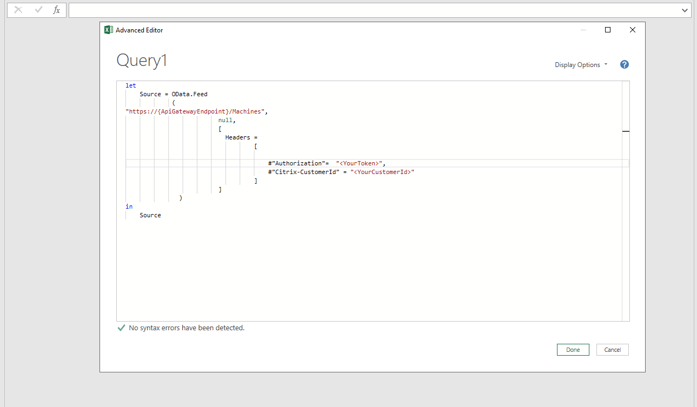
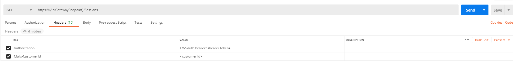

# Examples

## Example 1: MS Excel PowerQuery 

&#49;.	Open Excel (Excel 2016 has PowerQuery inbuilt. If you are using earlier versions of Excel, install PowerQuery, see [https://www.microsoft.com/en-in/download/details.aspx?id=39379)](https://www.microsoft.com/en-in/download/details.aspx?id=39379))

&#50;.	In Excel 2016, go to **Data** menu > **Get & Transform group** > **New Query** > **From Other Sources** > click **Blank Query**


&#51;. In the Query Editor window, go to **Home** menu > **Query group** > click **Advanced Editor**.


&#52;. In the Advanced Editor window, type the following query:

```js
let
    Source = OData.Feed
             ( 
"https://<YourCustomerId>.xdtesting.net/Citrix/monitor/odata/v4/data/Machines", 
                          null, 
                          [
                          	Headers = 
                                    [
                                    	Authorization = "<YourToken>",
                                     	Customer = "<YourCustomerId>"
                                    ]
                          ]
               )
in
	Source
```



Replace `<YourCustomerId>` and `<YourToken>` with the values of CustomerID and bearer token you obtained as described in the Generate the Citrix Cloud Bearer Token section. Once the **No Syntax errors have been detected** is displayed in the bottom of the window, click **Done**.

&#53; Upon successful authentication, the results are displayed as a table. In this example, the table lists all the Machines of the CustomerId. If the authentication fails, either the bearer token or the CustomerId might be invalid. Please verify the same and try again.

## Example 2: C# Client Library

Use a Simple.OData.Client to create a C# client for an OData v4 endpoint. For information about installation of its Nuget Package, see [https://github.com/object/Simple.OData.Client/wiki/Getting-started-with-Simple.OData.Client](https://github.com/object/Simple.OData.Client/wiki/Getting-started-with-Simple.OData.Client).

Install the package using the Nuget Package Manager:

```
Install-Package Simple.OData.Client
```
After installation, use the package with the following command:

```
using Simple.OData.Client;
```

As the OData query in the Cloud requires the Citrix Cloud authentication, the OData clients must pass the bearer token (as documented in the **Generate Citrix Cloud Bearer Token** section) and the CustomerId. Set up the headers as follows, before creating the OData query:

```js
ODataClientSettings settings = new ODataClientSettings();
settings.BeforeRequest += request => 
{
    request.Headers.Add("Authorization", "<BearerToken>");
    request.Headers.Add("Customer", "<customerId>");
};

settings.BaseUri = new Uri("https://<customerId>.xdtesting.net/Citrix/monitor/odata/v4/data");
client = new ODataClient(settings);
```

Data can be retrieved by using async methods. This example lists all the Machines

```js
public static async void GetMachines()
{
    var machines = await client.FindEntriesAsync("Machines");
    foreach(var machine in machines)
    {
        Console.WriteLine(machine["Id"]);
        }
}
```
## Example 3: PowerShell

Below is a sample OData query triggered from PowerShell with the headers initialized and the Raw XML output redirected to a file:

```powershell
PS C:\> $headers = @{"Authorization" = "<BearerToken>”; "Customer" = "<Your Customer Id>"}

PS C:\> $url = https://<Your Customer Id>.xdtesting.net/Citrix/Monitor/OData/v4/Data/Users

PS C:\> $result = Invoke-WebRequest -Uri $url -Headers $headers

PS C:\> $result.Content > <Path-to-Output-File>
```
## Example 4: REST clients (Ex. Postman Chrome Ext.)

1.	Install Postman from Chrome extensions. See [https://chrome.google.com/webstore](https://chrome.google.com/webstore).
2.	Launch the application.
3.	Select GET in the dropdown and type in the URL to request. 
4.  Insert headers with your token and customerId. Click **Send**.
1.  If authentication is successful, response data is seen in the Response section of Postman.

## Aggregation Queries in Odata v4

Aggregation queries were not supported in OData Version 3 and earlier. It is supported in OData Version 4. As per [OData documentation](http://docs.oasis-open.org/odata/odata-data-aggregation-ext/v4.0/cs01/odata-data-aggregation-ext-v4.0-cs01.html), aggregation can be done using the `$apply=aggregate()` field. Below are few examples that show data aggregation. Use them after **https://{customer-id}.xdtesting.net/Citrix/Monitor/Odata/v4/Data/<TableName>**

`?$apply=aggregate`([column to aggregate] with [aggregation type] as [new column name])

**Aggregation Types:**

* Count : `Machines?$count=true`

This gives the total number of machines.

* Sum : `Sessions?$apply=aggregate(SessionType with sum as Total)`

This gives the sum of session types in Sessions.

* Min : `Machines?$apply=aggregate(LifecycleState with min as MinimumLCstate)`

This gives the minimum of all the life cycle states.
